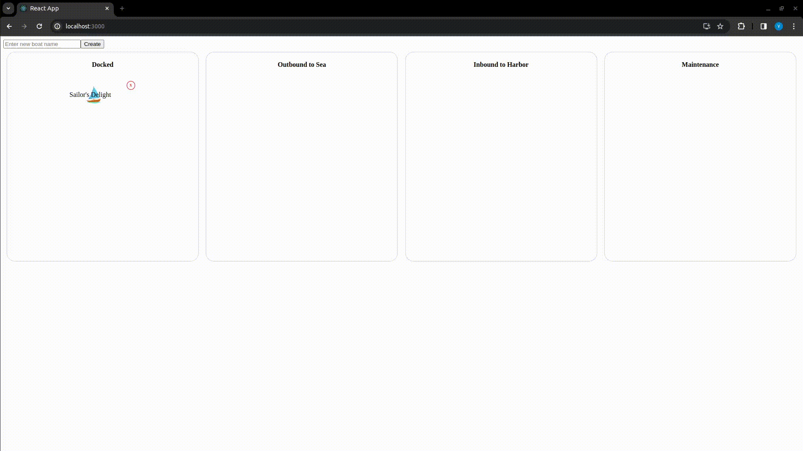

# TWU Project - Local Deployment Guide

The following guide provides instructions on how to manage the Docker containers for the TWU Project locally.

## Prerequisites

- Docker and Docker Compose installed on your machine.

## Starting the Containers

1. Navigate to the project root directory.
2. Run the following command:

   ```bash
   docker-compose -p twuproject up -d
   ``` 
This will start the containers in detached mode (running in the background).
Then you can go to [http://localhost:3000/](http://localhost:3000/)



## Running Tests

This project includes various types of tests: Frontend tests with Jest, API tests with Pytest, and End-to-End (E2E) tests with Playwright. Below are the instructions for running each type of test.

### JEST Frontend Tests

To run the frontend tests with Jest, follow these steps:
   ```sh
   cd app/frontend
   npm test -- --watchAll=false
   ``` 

### Pytests for API Endpoints
To run the frontend tests with Jest, follow these steps:
   ```sh
   cd api
   pytest test_api.py
   ``` 

### Playwright E2E Tests
Before running the E2E tests, ensure that both the frontend and backend services are running. Then, follow these steps:
   ```sh
   cd app/e2e
   npx playwright test
   ``` 
Make sure you have all the necessary dependencies installed and the services running as expected before attempting to run the tests.

